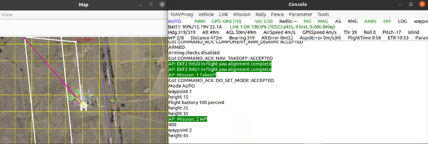

# Gecko
This repo contains the source code of Gecko, which is structured as follows:


```
./Gecko                   ## Main source code of Gecko  
├── ./SVF/               ## Source code for program analysis  
│   ├── ./tools/recovery_pass  ## Compartmentalization and data-flow integrity detection  
├── ./checkpoint_restore/      ## Source code for checkpointing and restore
```

## Setup 

**All code is only tested on Ubuntu 20.04. To ensure compatibility and avoid potential issues, we recommend running it on Ubuntu 20.04.**

We provide instructions for running a pre-configured Docker container or installing all dependencies from scratch. We recommend using Docker, but if you'd prefer to install manually, please refer to the instructions in the `INSTALL.md` file.


### Set up Docker

You can also use our preconfigured Docker setup. In that case, you'll need to install Docker first. 
The instruction for installing docker is from: [Install Docker Desktop on Linux | Docker Documentation](https://docs.docker.com/desktop/install/linux-install/)

Uninstall old versions

```
for pkg in docker.io docker-doc docker-compose podman-docker containerd runc; do sudo apt-get remove $pkg; done
```
Set up the repository

1. Update the  `apt`  package index and install packages to allow  `apt`  to use a repository over HTTPS:
   
   ```
   sudo apt-get update
   sudo apt-get install ca-certificates curl gnupg
   ```

2. Add Docker’s official GPG key:
   
   ```
   sudo install -m 0755 -d /etc/apt/keyrings
   curl -fsSL https://download.docker.com/linux/ubuntu/gpg | sudo gpg --dearmor -o /etc/apt/keyrings/docker.gpg
   sudo chmod a+r /etc/apt/keyrings/docker.gpg
   ```

3. Use the following command to set up the repository:
   
   ```
   echo \
     "deb [arch="$(dpkg --print-architecture)" signed-by=/etc/apt/keyrings/docker.gpg] https://download.docker.com/linux/ubuntu \
     "$(. /etc/os-release && echo "$VERSION_CODENAME")" stable" | \
     sudo tee /etc/apt/sources.list.d/docker.list > /dev/null
   ```
Install Docker Engine:

1. Update the apt package index:
   
   ```
    sudo apt-get update
   ```
2. Install Docker Engine, containerd, and Docker Compose.
   To install the latest version, run:
   
   ```
    sudo apt-get install docker-ce docker-ce-cli containerd.io docker-buildx-plugin docker-compose-plugin
   ```
3. Verify that the Docker Engine installation is successful by running the hello-world image.
   
   ```
    sudo docker run hello-world
   ```


## Run Gecko

#### Start the docker (Optional)

This step is only necessary if you're using Docker to run Gecko.

```
xhost +local:docker
(sudo) docker run -it  --privileged -e DISPLAY --env="QT_X11_NO_MITSHM=1" --volume="/tmp/.X11-unix:/tmp/.X11-unix:rw" ghcr.io/a01ixxx/gecko-image:stable
```

Then you will enter into the docker


#### Compile Time

Given CPS software such as ArduPilot, \sysname uses command line instructions to automatically compartmentalize and instrument the software.

```bash
$ cd ~
$ cd ./ardupilot_redcaps/
$ ./1_compartmentalization.sh
```

The compartmentalization result is in the file \textit{./build/sitl/compartments\_result.json}. The functions and variables are partitioned into different compartments (code and data regions).


Next, \sysname uses the following command line to automatically instrument the defense mechanism in the given application with our customized compiler. 


```bash
$ ./2_instrumentation.sh
```

The final binary result is the file \textit{./build/sitl/bin/arducopter}. You can use the following command to check the instrumented attack detection codes.


#### Run time

Launching the ArduPilot simulation requires multiple commands, so we provide three scripts to simplify the process. 

The first script launches ArduPilot and checkpoints a program in memory, which will be used later.

```bash
$ cd ~/ardupilot_recovery
$ ./prepare_checkpoint.sh
# You may need to enter the sudo passwd
```


The second script automatically configures the drone, launches the mission, and opens two panels to display simulation information. 

```bash
$ cd ./ardupilot_redcaps/
$ ./launch_demo.sh
[Gecko] Using the native block.
[Gecko] Using the native block.
```

Please wait about 1–3 minutes for the drone to begin its mission. Once it starts, it should look like the figure below.





Then, return to your main terminal by **detaching** from the current tmux session: press <kbd>Ctrl</kbd>+<kbd>B</kbd>, then <kbd>D</kbd>.
Next, you can run the thrid script, which is designed to trigger a program crash and then recover it from a checkpoint.  


```bash
$ ./launch_attack_recovery.sh
[Gecko] The task is restored !!! 
With response time: xxx seconds
[Gecko] Using the recovery block.
[Gecko] Using the recovery block.
```


This will cause the program, namely _arducopter_, to crash and then restore it from a previously saved checkpoint. After recovery, the system transitions to a shadow compartment. This is indicated by continuous logs showing the use of the recovery block, as shown below:
